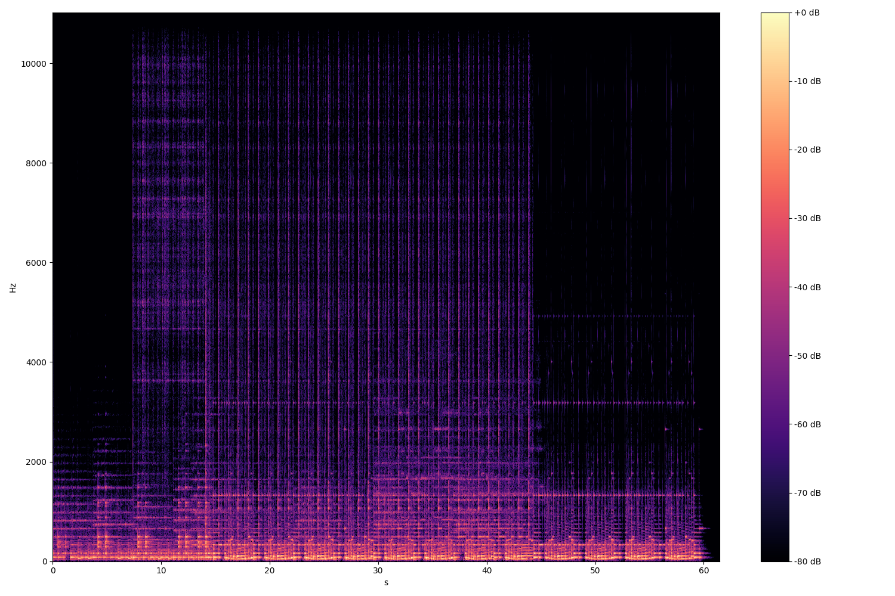
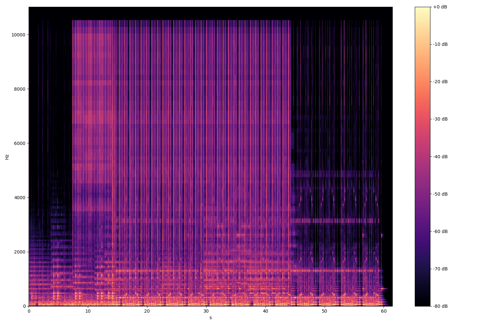

# papre
Pytorch Audio Preprocessors.


Having audio feature transforms implemented as layers allows for powerful on-the-fly computation and eliminates the need for storing them.

It's a similar idea to [kapre](https://github.com/keunwoochoi/kapre), where the performance was studied in [this paper](https://arxiv.org/abs/1706.05781).


## Contents
- [Usage](#usage)


## Usage
Plotting the *Spectrogram* and *MelSpectrogram* of a signal.
```python
import torch, librosa
from utils import plot_melspectrogram, plot_spectrogram

y, sr = librosa.load(librosa.util.example_audio_file())
y = torch.from_numpy(y).unsqueeze(0)

win_length = 2048
n_fft = 2048
hop_length = 512

plot_spectrogram(y, sr, 'spec.png', torch.hann_window(win_length), hop_length, n_fft)
plot_melspectrogram(y, sr, 'mel_spec.png', torch.hann_window(win_length), hop_length, n_fft)
```

<p align="center">


</p>


Using a *Spectrogram* layer in a module is then as easy as:
```python
import torch, librosa
from papre import MelSpectrogram

class AudioNN(torch.nn.Module):

    def __init__(self, hop, n_fft, n_mels):
        super(AudioNN, self).__init__()
        self.spec = MelSpectrogram(hop=hop, n_fft=n_fft, n_mels=n_mels)
        self.lin = torch.nn.Linear(n_mels, 10)

    def forward(self, x):
        x = self.spec(x)
        x = x.view(x.size(0), -1, x.size(3))
        x = x.mean(dim=1)
        x = self.lin(x)
        x = torch.nn.functional.log_softmax(x, dim=1)
        return x

y, sr = librosa.load(librosa.util.example_audio_file())

n_fft = 2048
n_mels = 128
hop = 512

sig = torch.from_numpy(y).view(1,1,-1).cuda()

model = AudioNN(hop=hop, n_fft=n_fft, n_mels=n_mels).cuda()
print(model)

>> AudioNN(
>>  (spec): Spectrogram()
>>  (lin): Linear(in_features=1025, out_features=10, bias=True)
>>)

spec = model(sig)
print(spec.shape, spec.is_cuda)

>> torch.Size([1, 10]) True

```

*MaskConv2d* wraps [nn.Conv2d](https://pytorch.org/docs/stable/nn.html#torch.nn.Conv2d) so that images of different height (or in this case spectrograms of different sequence length) can be passed and the intra batch lengths are not lost. Convolutional layers can then be be connected to recurrent layers like:

```python
import torch
from papre import Spectrogram, MelSpectrogram, MaskConv2d

class AudioModule(torch.nn.Module):

    def __init__(self, hop, n_fft):
        super(AudioModule, self).__init__()
        #self.spec = MelSpectrogram(hop=hop, n_fft=n_fft, n_mels=128)
        self.spec = Spectrogram(hop=hop, n_fft=n_fft)
        self.conv = MaskConv2d(2, 12, kernel_size=5)
        lstm_inp = 12 * self.conv._out_dim(n_fft//2 + 1)
        #lstm_inp = 12*self.conv._out_dim(self.spec.n_mels) 
        self.lstm = torch.nn.LSTM(lstm_inp, 80, 2, batch_first=True)
        self.lin = torch.nn.Linear(80, 5)

    def forward(self, batch):
        x, lengths = batch
        
        # Compute Spectrogram given padded sequence
        x, lengths = self.spec(x, lengths)

        # Compute conv given padded sequence
        x, lengths = self.conv(x, lengths)
        x = x.transpose(1,2).contiguous().view(x.size(0), x.size(2), -1) 

        # Pack sequence for lstm processing
        x_pack = torch.nn.utils.rnn.pack_padded_sequence(x, lengths, batch_first=True)
        x_pack, _ = self.lstm(x_pack)
        x, lengths = torch.nn.utils.rnn.pad_packed_sequence(x_pack, batch_first=True)
        
        # Many-to-one rnn
        x = x[torch.arange(x.size(0)),lengths - 1]
        
        x = self.lin(x)
        x = torch.nn.functional.log_softmax(x, dim=1)
        return x


n_fft = 2048
hop = 512

seconds = 5
sr = 44100
frames = sr*seconds

# Example batch of padded sequence data
# where sr*seconds is the max_length of a sequence
audio_batch = torch.randn(16, 2, frames)

# Example of sorted sequence lengths. Compute each of the 16
# lengths <= max frames
lengths = torch.sort(
    torch.LongTensor(16).random_(frames-2*sr, frames), 
    descending=True)[0]
    
print(lengths)
>> tensor([219303, 210327, 203494, 201316, 199177, 196951, 190162, 184709, 183979,
        173688, 166729, 166010, 162292, 142876, 142064, 141654])


audio_batch, lengths = audio_batch.cuda(), lengths.cuda()
batch = (audio_batch, lengths)
model = AudioModule(hop=hop, n_fft=n_fft).cuda()

ret = model(batch)

print(ret.shape, ret.is_cuda)

>> torch.Size([16, 5]) True

```


